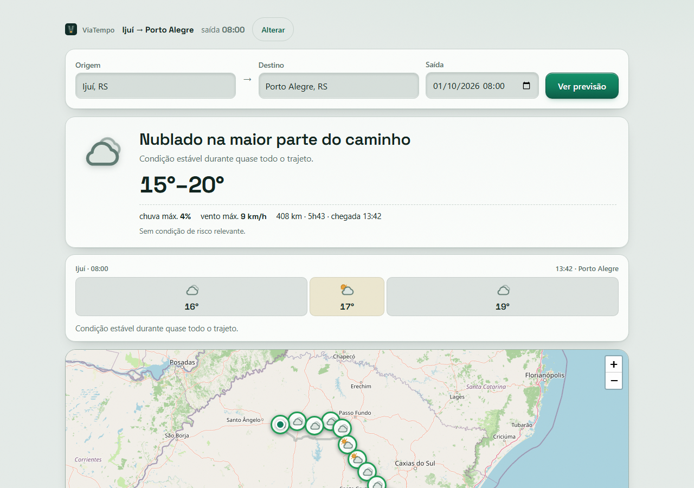
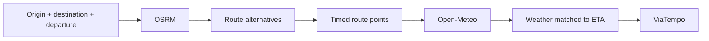

# ViaTempo

<<<<<<< HEAD
> Weather along the way, at the right time.

[Live Demo](https://viatempo.ricarossetto.workers.dev) · [Português](./README.pt-BR.md)



ViaTempo is an open-source road-trip weather planner.

Enter your origin, destination and departure time. ViaTempo calculates
route alternatives and matches hourly weather forecasts to the estimated
time you will reach each part of the road — instead of showing only the
weather at your destination.

No account. No API key. No paid APIs.

## Why ViaTempo?

A regular weather app answers:

> What will the weather be in Porto Alegre?

ViaTempo answers:

> What weather will I actually encounter during the trip, at the time I reach each part of the route?

A trip crosses space **and** time. Forecasts should follow both.

## Features

- Weather matched to ETA along the route
- Alternative driving routes
- Animated weather visualization
- Weather chapters and forecast ribbon
- Temperature, rain, wind and visibility
- Departure-time simulation
- Interactive route map
- Map ↔ forecast interaction
- Weather-aware route segments
- Reduced-motion support
- Responsive mobile UI
- No signup
- No API keys
- Free public-data stack

## How it works



1. Geocode origin and destination (Open-Meteo geocoding).
2. Fetch up to 3 route alternatives (OSRM, with FOSSGIS fallback).
3. Sample points along the selected route and estimate arrival time per point.
4. Fetch hourly forecasts in one batched Open-Meteo request and interpolate to each ETA.
5. Render chapters, ribbon, timeline and weather-colored route segments.

## Architecture

```text
Browser
  ├── Vite + TypeScript
  ├── Leaflet
  ├── OSRM (routing, client-side)
  ├── Open-Meteo (weather + geocoding, client-side)
  └── OpenStreetMap tiles

Cloudflare
  ├── Static Assets → dist/
  └── Worker
       └── GET /api/health
```

Routing and weather stay client-side. The Worker currently only serves a
healthcheck; future `/api/*` endpoints (shared cache, rate limiting) go there
only if they bring a concrete advantage.

## Tech stack

| Purpose | Technology |
| --- | --- |
| Language | TypeScript |
| Frontend | Vite |
| Maps | Leaflet |
| Routing | OSRM |
| Weather & geocoding | Open-Meteo |
| Map tiles/data | OpenStreetMap |
| Hosting | Cloudflare Workers + Static Assets |
| E2E | Playwright |

## Free public-data stack

No API key, no account, no paid APIs in the current state. Limits to be aware of:

- Public OSRM instances have no SLA; fair use, ~1 req/s, with automatic fallback.
- OpenStreetMap tiles follow the Tile Usage Policy (attribution required).
- Open-Meteo free tier: 10k requests/day, CC-BY (attributed in the footer).
- High traffic will require revisiting this architecture. Nothing here is "unlimited".

## Privacy

- No signup, no user database, no account, no first-party analytics.
- Origin, destination and coordinates are sent to the external services needed
  to compute the forecast (OSRM, Open-Meteo). We do not claim zero external
  requests — the app cannot work without them.

## Limitations

- No live traffic: ETAs ignore real-time congestion.
- Forecasts may change; public services can throttle or fail.
- Route alternatives depend on OSRM.
- Not turn-by-turn navigation.
- Not a replacement for official severe-weather or safety information.

## Local development

```bash
npm install
npm run dev
```

Local: `http://localhost:5173/`

## Tests

```bash
npm run build        # tsc + vite build (must pass)
npm run test:routing # OSRM parser, offline
npm run test:journey  # weather summary + chapters, offline
npm run test:e2e      # Playwright + Chromium (needs npm run dev running)
npm run test:prod     # production smoke test, see below
```

## Production smoke test

PowerShell:

```powershell
$env:BASE_URL="https://viatempo.ricarossetto.workers.dev"
npm run test:prod
```

Unix:

```bash
BASE_URL="https://viatempo.ricarossetto.workers.dev" npm run test:prod
```

## Deploy

```bash
npm run cf:dev   # build + local Cloudflare environment
npm run deploy   # build + publish frontend and Worker
```

- Vite builds to `dist/`.
- Cloudflare Static Assets serve the frontend; `/api/*` runs the Worker.
- Today the Worker only exposes `/api/health`.
- Automatic deploys: connect the GitHub repo in Workers Builds (dashboard).
- Custom domain: Worker → Domains → Add Custom Domain (DNS + certificate automatic).
- Rollback: dashboard → Workers & Pages → Deployments → promote a previous version.
- Secrets (when needed): `wrangler secret put NAME`. Never commit `.dev.vars` or tokens.

## Backend engine (INMET + CPTEC + edge API)

Same product, server-side weather engine: normalized domain, INMET
observations, CPTEC model tracking (WRF/MERGE GRIB), fallback chain,
hazard rules, batch + trip endpoints. Lives in `apps/api/`,
`packages/*`, `services/meteo-ingestor/`, `worker/`.

- Local API: `npm run dev:api` → http://localhost:3001 (`/` landing, `/api/*`)
- Edge API + cron ingest: `npm run cf:api-dev` → deploy with `npm run deploy:api`
  (`wrangler.api.jsonc`, worker `viatempo-api` + KV `INGEST`)
- Tests: `npm run test:offline` (19, deterministic) · `npm run smoke` (live sources)
- Research & decisions: `docs/PESQUISA-FONTES.md`, `docs/COMPARACAO-MODELOS.md`,
  `docs/ARQUITETURA.md`, `docs/API.md`, `docs/FRONTEND.md`, `docs/RELATORIO.md`

## License

MIT. See [LICENSE](./LICENSE).
=======
Planejador meteorológico de viagens rodoviárias.

> Estado: MVP funcional com dados reais (ver `docs/RELATORIO.md`).

## Quickstart

```bash
npm install
npm run dev --workspace apps/api
# API em http://localhost:3001
```

```bash
# timeline Ijuí → Porto Alegre
curl -s -X POST http://localhost:3001/api/trips/forecast \
  -H 'content-type: application/json' \
  -d '{"origin":"Ijuí, RS","destination":"Porto Alegre, RS","departure":"2026-10-01T14:30:00-03:00"}' | head -c 2000
```

## Estrutura

```text
apps/api/                  API (weather batch, trips, health) + landing em public/
packages/weather-domain/   domínio normalizado, hazard, unidades, WMO
packages/providers/        Open-Meteo, INMET, CPTEC, alertas, engine+cache
packages/routing/          geocoding, OSRM, construção da timeline de ETAs
services/meteo-ingestor/   ingestão programada (Python xarray/cfgrib + Node)
data/                      amostras reais + fixtures determinísticas
docs/                      pesquisa, arquitetura, API, frontend, relatório
examples/                  JSONs reais + mocks para o frontend
scripts/                   smoke tests reais, benchmark
```

## Docs

- `docs/PESQUISA-FONTES.md` — situação operacional verificada em 2026-09-30
- `docs/COMPARACAO-MODELOS.md` — comparação com evidência + decisão
- `docs/ARQUITETURA.md`
- `docs/API.md` + `docs/FRONTEND.md`
- `docs/RELATORIO.md` — relatório final objetivo
>>>>>>> backend-work
