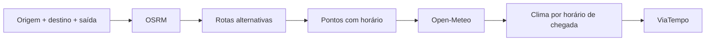

# ViaTempo

> O clima da sua viagem, no tempo certo.

[Demo ao vivo](https://viatempo.ricarossetto.workers.dev) · [English](./README.md)


ViaTempo é um planejador open source de clima para viagens de carro.

Informe origem, destino e horário de saída. ViaTempo calcula rotas alternativas
e combina a previsão horária com o horário estimado em que você vai passar por
cada trecho da estrada — em vez de mostrar só o tempo no destino.

Sem cadastro. Sem API key. Sem APIs pagas.

## Por que ViaTempo?

Um app de tempo comum responde:

> Como vai estar o tempo em Porto Alegre?

ViaTempo responde:

> Que tempo vou encontrar durante a viagem, na hora em que eu passar por cada trecho?

Uma viagem atravessa espaço **e** tempo. A previsão deveria acompanhar os dois.

## Recursos

- Clima combinado com o horário de chegada em cada trecho
- Rotas alternativas de carro
- Visualização animada do tempo
- Capítulos de clima e faixa de previsão
- Temperatura, chuva, vento e visibilidade
- Simulação de horário de saída
- Mapa interativo da rota
- Interação mapa ↔ previsão
- Trechos coloridos pela condição
- Suporte a reduced motion
- Interface mobile responsiva
- Sem cadastro
- Sem API keys
- Stack gratuita de dados públicos

## Como funciona



1. Geocodifica origem e destino (geocoding Open-Meteo).
2. Busca até 3 rotas alternativas (OSRM, com fallback FOSSGIS).
3. Amostra pontos da rota escolhida e estima o horário em cada um.
4. Busca a previsão horária em 1 request Open-Meteo e interpola por horário.
5. Renderiza capítulos, faixa, timeline e trechos coloridos.

## Arquitetura

```text
Navegador
  ├── Vite + TypeScript
  ├── Leaflet
  ├── OSRM (rota, client-side)
  ├── Open-Meteo (clima + geocoding, client-side)
  └── Tiles OpenStreetMap

Cloudflare
  ├── Static Assets → dist/
  └── Worker
       └── GET /api/health
```

Rota e clima continuam client-side. O Worker hoje só tem healthcheck; futuros
endpoints `/api/*` (cache compartilhado, rate limit) entram só com vantagem concreta.

## Stack

| Propósito | Tecnologia |
| --- | --- |
| Linguagem | TypeScript |
| Frontend | Vite |
| Mapas | Leaflet |
| Rotas | OSRM |
| Clima e geocoding | Open-Meteo |
| Tiles/dados do mapa | OpenStreetMap |
| Hospedagem | Cloudflare Workers + Static Assets |
| E2E | Playwright |

## Stack gratuita de dados públicos

Sem API key, sem conta, sem APIs pagas no estado atual. Limites:

- Instâncias públicas do OSRM não têm SLA; fair use, ~1 req/s, com fallback.
- Tiles OSM seguem a Tile Usage Policy (atribuição obrigatória).
- Open-Meteo gratuito: 10k req/dia, CC-BY (atribuído no rodapé).
- Alto tráfego vai exigir revisitar a arquitetura. Nada aqui é "ilimitado".

## Privacidade

- Sem cadastro, sem banco de usuários, sem conta, sem analytics próprio.
- Origem, destino e coordenadas vão para os serviços externos necessários ao
  cálculo (OSRM, Open-Meteo). Não afirmamos zero requests externas.

## Limitações

- Sem trânsito ao vivo: horários ignoram congestionamento.
- Previsões mudam; serviços públicos podem limitar ou falhar.
- Alternativas dependem do OSRM.
- Não é navegação curva a curva.
- Não substitui alertas oficiais de tempo severo ou segurança.

## Desenvolvimento local

```bash
npm install
npm run dev
```

Local: `http://localhost:5173/`

## Testes

```bash
npm run build        # tsc + vite build (precisa passar)
npm run test:routing # parser OSRM, sem rede
npm run test:journey  # resumo + capítulos, sem rede
npm run test:e2e      # Playwright + Chromium (exige npm run dev rodando)
npm run test:prod     # smoke de produção, ver abaixo
```

## Smoke de produção

PowerShell:

```powershell
$env:BASE_URL="https://viatempo.ricarossetto.workers.dev"
npm run test:prod
```

Unix:

```bash
BASE_URL="https://viatempo.ricarossetto.workers.dev" npm run test:prod
```

## Deploy

```bash
npm run cf:dev   # build + ambiente Cloudflare local
npm run deploy   # build + publica frontend e Worker
```

- Vite gera `dist/`.
- Static Assets servem o frontend; `/api/*` executa o Worker.
- Hoje o Worker só expõe `/api/health`.
- Deploy automático: conectar o repo GitHub no Workers Builds (dashboard).
- Domínio customizado: Worker → Domains → Add Custom Domain (DNS + certificado automáticos).
- Rollback: dashboard → Workers & Pages → Deployments → promover versão anterior.
- Secrets (quando houver): `wrangler secret put NOME`. Nunca commitar `.dev.vars` nem tokens.

## Licença

MIT. Ver [LICENSE](./LICENSE).
